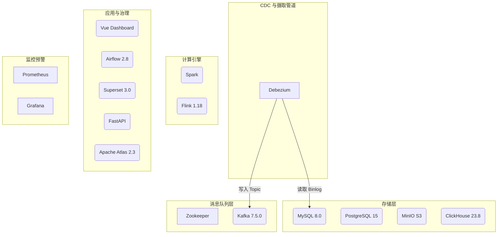

# Ecommerce Data Platform 部署与运维指南

本指南提供了针对 `ecommerce-data-platform` 的两种部署方式（Docker Compose 和 Kubernetes）及运维管理说明。

## 架构总览

数据平台包含以下分层服务集群：



## 前置依赖

无论是采用哪种模式，请确保本地已有如下工具支撑：
- Docker & Docker Compose (v2)
- Kubectl & 一套本地或远程的 K8s 集群控制权 (Docker Desktop 内置或 Minikube)

## 模式一：Docker Compose 快速部署

在 `platform` 目录下，直接利用 `platform-ctl` 脚本。该脚本封装了 Compose 命令。

### 1. 启动所有服务
```bash
# Linux/Mac
./platform-ctl.sh start

# Windows
.\platform-ctl.ps1 start
```

### 2. 检查与验证状态
```bash
./platform-ctl.sh status
```

### 3. 数据初始化
启动服务后，需要进行 Kafka Topic 和数据库等的初始化操作：
```bash
./platform-ctl.sh init
```

### 4. 停机或重启
```bash
./platform-ctl.sh stop
./platform-ctl.sh restart
```

## 模式二：Kubernetes 部署

项目包含全套 k8s manifest（在 `platform/k8s/` 中），可通过脚本快速 apply 进集群。

### 1. 部署所有资源到集群
```bash
# Linux/Mac
./platform-ctl.sh -m k8s start

# Windows
.\platform-ctl.ps1 -m k8s start
```
这将在 k8s 中创建名为 `ecommerce-data-platform` 的 namespace，并拉起所有的 Deployment/StatefulSet。

### 2. 初始化 K8s 服务
```bash
./platform-ctl.sh -m k8s init
```

### 3. 观察资源状态与日志
```bash
./platform-ctl.sh -m k8s status
# 查看日志 (例: Kafka)
./platform-ctl.sh -m k8s logs kafka
```

### 4. 卸载集群资源
```bash
./platform-ctl.sh -m k8s stop
```

## 服务暴露与访问端口汇总

默认情况下，使用本地映射或 NodePort 等机制提供的访问点如下：

| 服务 | 面板/作用 | 本地端口映射 | 默认凭据 |
| --- | --- | --- | --- |
| **MySQL** | 业务关联库 | `3306` | root / 123456 |
| **PostgreSQL** | 元数据库 | `5432` | admin / admin123 |
| **ClickHouse** | OLAP 查询/原生 | `8123` / `9000` | default / clickhouse123 |
| **MinIO** | S3 文件网关 UI | `9001` | admin / admin123456 |
| **Kafka UI** | 队列监控 | `8080` | NA |
| **Flink UI** | 流处理作业控制 | `8081` | NA |
| **Airflow** | 调度管控 | `8085` | admin / admin123 |
| **Superset** | 图表汇聚展示 | `8088` | admin / admin123 |
| **Grafana** | 基建与作业性能监控 | `3000` | admin / admin123 |
| **Prometheus** | 时序数据库引擎 | `9090` | NA |
| **Apache Atlas**| 数据血缘及治理 | `21000`| admin / admin |
| **FastAPI** | 自研查询接口 | `8000` | NA |
| **Vue Frontend** | 电商分析控制台 | `5173` | NA |

> 注意：所有敏感密码均可在 `platform/.env` (针对 Compose) 或 `platform/k8s/secrets.yml` (针对 K8s) 中修改。

## 前端控制台

本项目新增了 `platform/frontend` Vue 前端，用于展示电商全路径分析结果。界面风格参考 `qt-vue+flask` 项目的左侧工作台布局、暖色纸张卡片和统计面板，但不包含右侧 AI 助手。

本地开发：

```bash
cd platform/frontend
npm install
npm run dev
```

Docker Compose 启动平台后访问：

```text
http://localhost:5173
```

前端默认读取 `/api/v1/*` 与 `/health`，开发模式由 Vite 代理到 `http://localhost:8000`，Docker 模式由 Nginx 转发到 `fastapi:8000`。如果后端服务暂时不可用，页面会自动显示内置演示数据，方便课堂展示和答辩。

## 故障排查建议 (Troubleshooting)

**Q：Airflow 或 Superset UI 不能登录或者报错 DB 错误？**
A：这两个业务强依赖 PostgreSQL，需保证 PostgreSQL 就绪后再启动。如果依旧出现表缺失，可以尝试运行初始化容器的 DB Migrate：
执行 `./platform-ctl.sh init`

**Q：Kafka UI 连不上 Broker？**
A：如果 Kafka 还未完全选举完毕，Kafka-UI 会短暂失去连接。通常等待 30 秒至 1 分钟左右即可自恢复。

**Q：ClickHouse OOM（内存溢出）被 Kill？**
A：ClickHouse 是重内存应用。如果本地 Docker/K8s 分配的全局资源较小（小于 8GB RAM）可能会导致容器挂掉。请尝试将 Docker Engine 可支配内存提升至至少 12GB - 16GB。

**Q：部分端口产生冲突？**
A：如果在本地 `localhost` 已启动了独立的 MySQL（占用 3306 端口）等，可尝试修 `docker-compose.yml` 中的端口绑定，如改为 "13306:3306"。
